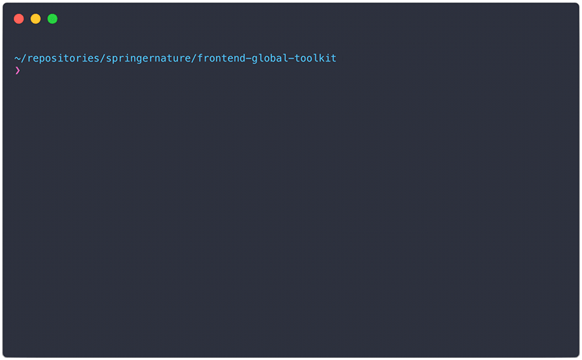

# Frontend Global Toolkit

 [](https://travis-ci.org/springernature/frontend-global-toolkit)
[][info-license]
[](https://github.com/sindresorhus/xo)

> Shared front-end packages published via NPM

The global toolkit contains front-end packages that can be used on all Springer Nature products. Packages can contain one or more of `css`, `javascript`, `templates`, `images`, `tests`. Each package should have its own folder in `./packages`, which result in it being published to NPM using the `@springernature` scope.

### Writing a package

All packages are validated on our CI server (Travis) to ensure they conform to certain naming conventions, file/folder structure, and that certain required files are present. The validation is configurable in the [`validation.json`](validation.json) file. The current configuration is described below.

You can validate all the packages by running `npm run validate` from within the project on the command line, or test only your package by running `npm run validate global-name-of-package`.

**You can auto-generate a new package with the correct configuration by running `npm run create` from within the project on the command line. This will generate a folder in the `packages` directory with the correct files and folders.**



### Package structure

```
frontend-global-toolkit
  └── packages
    ├── global-name-of-package
      └── scss
        └── **/*.{scss,css,md}
      └── js
        └── **/*.{js,json,md}
      └── view
        └── **/*.{html,dust,md}
      └── img
        └── **/*.{jpg,gif,png,svg,md}
      └── __tests__
        └── **/*.{js,json}
      └── .npmrc
      └── HISTORY.md
      └── package.json
      └── README.md
```

The files and folders detailed here are subject to the following validation rules:

- `.npmrc`, `README.md`, `HISTORY.md`, `package.json` are the only files allowed at the top level, they are all _required_
- The folders `scss`, `js`, `view`, `img` are the only folders that are allowed at the top level, they are _optional_
- Within these folders you can have any number of `sub-folders`, but there are restrictions on the file types allowed

Additionally the validation configuration ignores some files and folders such as `.DS_Store`.

### Naming

Packages should use the `global` prefix for naming. The package folder should use the convention `global-name-of-package`, where `name-of-package` uses only lowercase alphanumeric characters and hyphens.

#### `package.json`

Packages in `frontend-global-toolkit` are [scoped](https://docs.npmjs.com/misc/scope) to the `springernature` organisation. Packages are exported using the naming convention `@springernature/global-name-of-package`.

```json
{
  "name": "@springernature/global-name-of-package",
}
```

#### `.npmrc`

Your `.npmrc` file is used to publish packages via Travis CI, and **MUST** contain the following:

```
//registry.npmjs.org/:_authToken=${NPM_TOKEN}
```

#### SASS

When writing CSS you should follow the guidelines in the [Springer Nature Frontend Playbook](https://github.com/springernature/frontend-playbook/blob/master/css/), and in addition all SASS mixins/functions/variables should:

- Take the form `global-name-of-package--variable-name` for variables
- Take the form `global-name-of-package` for single mixins/functions
- Take the form `global-name-of-package--some-name` when there are multiple mixins/functions
- Use only lowercase alphanumeric characters and hyphens

```scss
// variables
$global-name-of-package--variable-name
$global-name-of-package--other-name

// mixins
@mixin global-name-of-package () {}
@mixin global-name-of-package--some-name () {}

// functions
@function global-name-of-package () {}
@function global-name-of-package--some-name () {}
```

#### Javascript

When writing Javascript you should follow the guidelines in the [Springer Nature Frontend Playbook](https://github.com/springernature/frontend-playbook/blob/master/javascript/)

### Testing

Tests for your package should be written in your `packages/global-name-of-package/__tests_` folder. For example, unit tests for `global-name-of-package` should live in `packages/global-name-of-package/__tests__/unit/*.js`.

To run all the tests use `npm test` from within the project on the command line. The run an individual test use `npm run testfile -- name-of-test-file`.

#### Linting

Javascript linting is enforced using [XO](https://github.com/sindresorhus/xo) across all packages. Run the linter using `npm run lint` from within the project on the command line.

### Publishing

To publish a new package please follow the [contributing guidelines](CONTRIBUTING.md). Publishing to NPM is done automatically in Travis.

License
-------

The frontend-global-toolkit repository is licensed under the [MIT License][info-license].
All packages within this repository are licensed under the [MIT License][info-license].
Copyright &copy; 2017, Springer Nature

[info-license]: LICENCE
