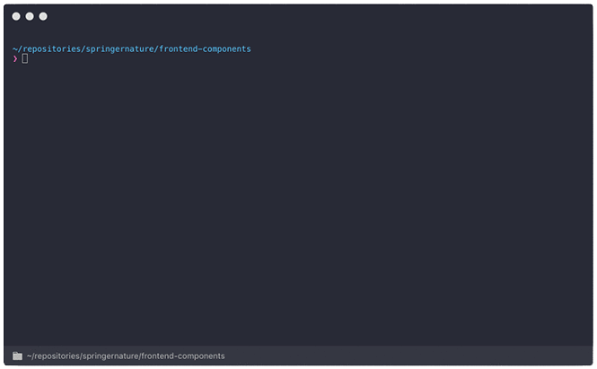
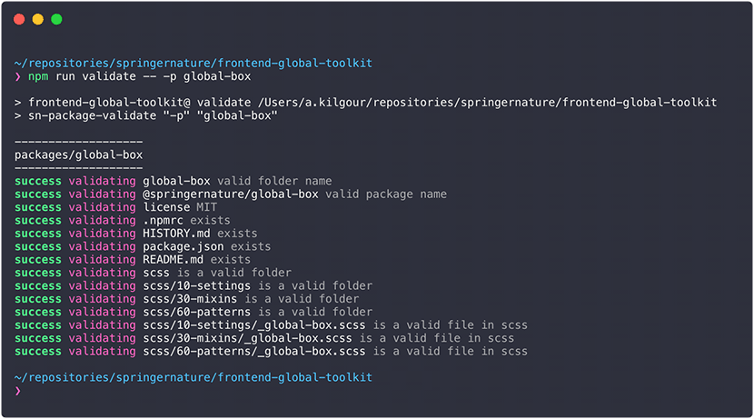

# Package manager

Handles the **creation**, **validation**, and **publication** of packages built as part of the Springer Nature Front-End Toolkits.

Packages are bundles of front-end assets (HTML, CSS, JS, Images) that are published via NPM and used within the Springer Nature ecosystem. It is expected that multiple packages live within one repository ([monorepo](https://medium.com/@maoberlehner/monorepos-in-the-wild-33c6eb246cb9)).

An example of this package in use can be found in the [Springer Nature Front-End Global Toolkit](https://github.com/springernature/frontend-global-toolkit)

## Install

```
$ npm install --save-dev @springernature/global-package-manager
```

Installing `global-package-manager` adds package management exectuables to `./node_modules/.bin/`.

## Configuration

The package manager is configurable to enforce consistency across packages that are created. Below is the default configuration that is supplied for Springer Nature toolkit packages.

### Default configuration

```json
{
  "scope": "springernature",
  "packagesDirectory": "./packages",
  "changelog": "HISTORY.md",
  "required": [
    "README.md",
    "package.json",
    ".npmrc"
  ]
}
```

#### scope
All packages must be published under an [organisation scope](https://docs.npmjs.com/misc/scope) on NPM. Packages within the Springer Nature ecosystem are published to the company scope and this **MUST NOT** be changed.

#### packagesDirectory
Packages should be self-contained units of code that all live within a specific directory within your repository.

#### changelog
All packages **MUST** have a changelog file in their root directory.

#### required
An array of file paths that **MUST** appear in any package. There is no need to specify the changelog file here, it is added automatically.

### Extending the default configuration

You have the ability to override the default configuration, and extend it with a number of other options by providing a `package-manager.json` file in the root of your repository, in the same location as your `package.json` file. This user configuration file should take the same format as the default configuration, and can also add the following options:

#### prefix
Package names can specify a prefix that namespaces them within NPM based on where within the Springer Nature ecosystem they originate.

For example all Springer Nature packages published via the [frontend-global-toolkit](https://github.com/springernature/frontend-global-toolkit) use the prefix `global`, they will appear on NPM as `@springernature/global-name-of-component`

#### folders
A folders object can be added to the config. This contains keys that map to any folder names that are allowed within a package, with their value being an array of allowed file extensions within that folder.

If the `folders` key is present then these folders are the only ones allowedn (but are optional). The folders can contain any number of sub-folders with no restriction on naming, but the file extensions within these sub-folders must match the array.

If the `folders` key is not present then any folders/files are allowed, with no restrictions.

The following example would allow a folder with the name `js` that contains files with the extensions `.js` and `.json`:

```json
"folders": {
  "js": [
    "js",
    "json"
  ]
}
```

## License

All packages that are published **MUST** be licensed. As packages are published as part of a monorepo the license file should live in the root of the repository, and be referenced in the `package.json`. If a `license` key is not found then no packages will be published.

## Usage

Three CLI scripts are provided as part of this package. They should all be run from your repository root, in the same location as your `package-manager.json` and `package.json` files.

### Package creation

The package creation script is a CLI based tool that can be used to quickly create a boilerplate new package based on the the configuration. This tool is designed to be run locally within your repository.

```
$ ./node_modules/.bin/sn-package-create
```



> Example from Springer Nature [Front-End Global Toolkit](https://github.com/springernature/frontend-global-toolkit)

### Package validation

The package validation script is a CLI based tool that will validate the packages against the configuration and provide output to the CLI. This can be run locally and as part of your CI environment.

Running this script will validate _all_ the packages in the provided packages directory:

```
$ ./node_modules/.bin/sn-package-validate
```

 Running with the `-p` argument will validate the package named after the argument:

 ```
 $ ./node_modules/.bin/sn-package-validate -p name-of-package
 ```

 If you are running these commands as part of an NPM script within your `package.json` then you should use the following format:

 ```
 $ npm run validate -- -p global-box
 ```

 

> Example from Springer Nature [Front-End Global Toolkit](https://github.com/springernature/frontend-global-toolkit)

### Package publication

The package validation script is a CLI based tool that will publish new or updated packages to NPM. This is designed to run on your CI environment and should not be run locally.

```
$ ./node_modules/.bin/sn-package-publish
```

## Continuous Integration

It is intended that the validation and publication scripts are run on your CI environment to ensure the safe and correct publication of packages.

### publishing

The publication script expects a valid NPM token that allows you to publish to the specified organisation. this should be stored as an Environment Variable with the name `NPM_TOKEN`.

The script also expects the Environment Variable `CHANGED_FILES` which contains a list of all the files changed within the current commit, seperated with a line-break.

The script will identify all valid packages within the specified packages directory, and publish a new version using the version number within the `package.json` file if that version is greater than the last version published on NPM. Version numbers of `0.0.0` are ignored.

The script also requires that the package `changelog` has been updated, and appears in the list of `CHANGED_FILES`, otherwise publication will not happen.

This package has been written to work with [TRAVIS CI](https://travis-ci.org/) and an example of the CI setup can be found in the Springer Nature [frontend-global-toolkit](https://github.com/springernature/frontend-global-toolkit).